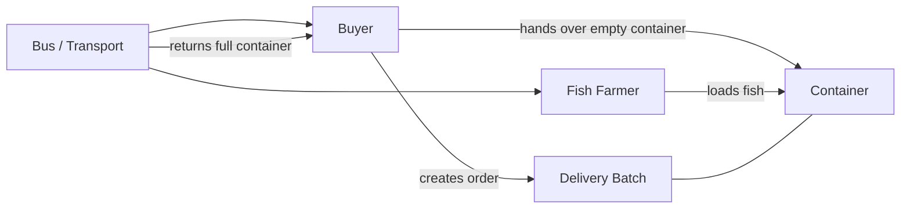

# Future Innovation Note: Fish Sector, Bus Logistics, and Container Tracking

**Status:** Proposed roadmap concept only. Not implemented in the current codebase.

**Purpose:** preserve the requested innovation in the documentation so it can be discussed, refined, and planned before any engineering work begins.

## 1. Summary

The proposed innovation extends the platform to support a Fish sector with a distinct fulfillment pattern:

- A farmer's store can be marked as a sector-specific store
- Fish farmers can indicate whether they have their own transport
- If a fish farmer does not have transport, the buyer selects a bus-based transport option
- The delivery becomes a multi-leg job
- A container is tracked independently from the order itself

The goal is to support a fish ordering flow that cannot be modeled cleanly as the current simple order-to-single-batch delivery pattern.

## 2. Business Goal

The requested addition is intended to:

- Expand the marketplace beyond the current produce-first model
- Introduce fish as a separate commercial and logistics category
- Support a container-return workflow that reflects real fish transport
- Reuse the existing logistics module rather than creating a parallel transport system

## 3. Proposed Product Changes

### 3.1 Farmer Store Setup

Add a store-level sector attribute such as:

- Vegetable
- Fruit
- Fish
- Other

For Fish stores, also capture whether the farmer has their own transport.

This is a store-level concern, not a user-level concern.

### 3.2 Buyer Fish Ordering Flow

The proposed fish ordering flow has two branches:

1. Fish farmer has own transport:
   - keep the current delivery experience
   - do not introduce fish-specific branching in the standard produce-like path

2. Fish farmer has no transport:
   - buyer selects a bus from the transport area
   - the flow becomes a three-step logistics process:
     - bus goes to the buyer with an empty container
     - bus moves the container to the farmer for loading
     - bus returns the full container to the buyer

### 3.3 Container Tracking

A container should be documented as a first-class tracked object with its own status lifecycle.

The proposed statuses are:

- Pending
- With buyer
- In transit to farmer
- With farmer
- In transit to buyer
- Delivered

The important documentation point is that container movement is independent from order status.

### 3.4 Logistics Model Extension

The proposal reuses the current logistics module and extends it for multi-leg jobs.

Rather than forcing a single delivery batch status to represent every step, the documented direction is to allow leg-by-leg tracking.

This is the right place to note that the current one-order-to-one-batch model is not sufficient for the fish use case.

## 4. Proposed System Shape

## 5. Documentation-Only Data Model Notes

The proposal introduces these concepts for future implementation planning:

- `Store.sector`
- `Store.hasOwnTransport`
- A `BUS` vehicle type
- A `Container` entity
- Multi-leg delivery batch support
- Optional container status history

The documentation should keep these as proposed concepts until engineering approves the final schema.

## 6. Constraints To Preserve

Any future implementation should respect the following:

- Existing produce flows should remain unchanged
- The logistics module should be extended, not replaced
- Fish support should be additive
- The buyer should not lose the current checkout experience for non-fish orders
- Documentation should clearly separate current behavior from planned behavior

## 7. Open Questions To Resolve Before Build

These items should remain open in the documentation until product decisions are made:

- Should a container attach to an order or to a specific order item / farmer fulfillment?
- Should the buyer choose a specific bus at checkout, or should a dispatcher assign it later?
- Should the transport flag live only on the store, or be configurable per product listing?
- Should a multi-leg delivery keep a batch-level status and also store leg-level records?

## 8. Recommended Documentation Position

For now, the cleanest documentation approach is:

- Mark this as future innovation
- Capture the intended business behavior
- Keep implementation details as proposal notes, not as shipped facts
- Revisit the schema only after the product decision on the open questions above

## 9. Relationship To The Current Product

This proposal builds on the current platform in a few visible ways:

- The web apps already separate buyer and farmer journeys
- The API already has stores, products, orders, logistics, and vehicles
- The platform already has a logistics module that can be extended

That means the fish sector is a natural expansion of the current system rather than a brand new product line.

