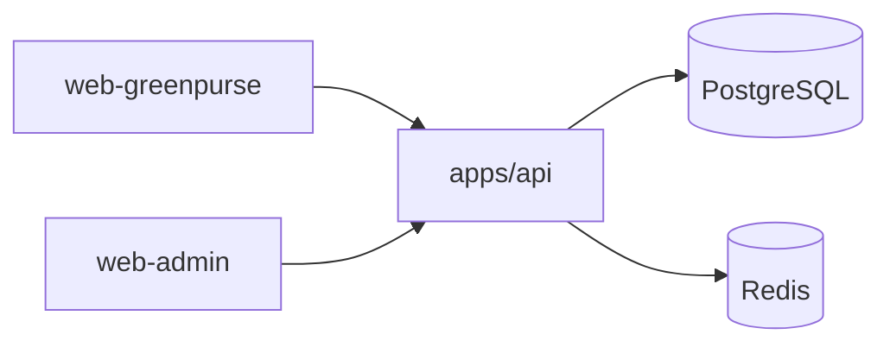

# AgriChain AI / AI-SUCE Product Functionality Overview

**Scope:** `apps/api`, `apps/web-greenpurse`, `apps/web-admin`

**Purpose:** capture the current product behavior as implemented in the codebase, with a clear separation between shipped functionality and future ideas.

## 1. Executive Summary

AgriChain AI, branded in the current codebase as AI-SUCE / GreenPurse / GreenSC, is a multi-app agricultural commerce platform.

The system currently supports:

- Buyer and farmer onboarding in the GreenPurse web app
- Product discovery, cart, checkout, orders, wallet, and notifications
- Farmer-facing product management screens
- A separate admin console for users, products, stores, orders, categories, coupons, logistics, and analytics
- A NestJS API that exposes auth, commerce, finance, logistics, market data, notifications, storage, AI, and admin endpoints

## 2. Product Surface

### 2.1 `apps/web-greenpurse`

This is the buyer and farmer-facing web experience.

Observed user-facing areas include:

- Landing page and product highlights
- Register and login
- Product catalog browsing and filtering
- Individual product details
- Cart and checkout
- Order history
- Wallet
- Notifications
- Settings
- Farmer dashboard
- Farmer product creation and editing
- Farmer profile and farmer order views

Several screens are currently driven by local mock data or UI state, especially the public home, catalog, order history, and wallet views. That suggests the front end is partly a polished product shell and partly a functional prototype in the current branch.

### 2.2 `apps/web-admin`

This is the operational/admin console.

Observed areas include:

- Login and register
- Overview dashboard and analytics
- User management
- Store management
- Product management
- Order management
- Logistics management
- Category management
- Coupon management
- Settings

The admin app is clearly positioned for internal operations rather than end users.

### 2.3 `apps/api`

This is the shared NestJS backend that powers both frontends.

Major functional modules present in the codebase:

- Auth
- Users
- Products
- Stores
- Categories
- Orders
- Addresses
- Coupons
- Wallet
- Logistics
- Markets
- Notifications
- Storage
- AI
- Admin
- Health
- Config
- Abuse protection
- Security
- Redis
- Scheduler

## 3. Current User Journeys

### 3.1 Buyer Journey

1. Open GreenPurse.
2. Register or log in.
3. Browse categories and products.
4. Filter products by search, category, and price.
5. Add products to cart.
6. Enter delivery details during checkout.
7. Choose a payment method.
8. Place the order.
9. View the order in order history and monitor its status.
10. Use the wallet and notifications features as needed.

### 3.2 Farmer Journey

1. Register or log in as a farmer.
2. Access the farmer dashboard.
3. Create or edit produce listings.
4. Review sales and orders.
5. Use wallet features for balance, top-up, and withdrawals.
6. Monitor farm-oriented views and supporting features exposed in the farmer area.

### 3.3 Admin Journey

1. Log in to the admin console.
2. Review KPIs and analytics.
3. Manage users, stores, products, categories, and coupons.
4. Review and update orders.
5. Inspect logistics data.
6. Monitor platform health and operational summaries.

## 4. Backend Functionality

### 4.1 Authentication and Account Management

The API includes:

- User registration
- Login
- PIN verification
- OTP send and verify
- Token refresh and logout
- Password change
- Email verification and resend flows
- Forgot-password and reset-password flows

The API bootstrap applies:

- Global prefixing at `/api/v1`
- Validation pipes
- Security headers via Helmet
- CORS allowlisting
- Throttling
- Global auth guarding

### 4.2 Catalog and Commerce

The platform supports:

- Product listing
- Trending products
- Personalized product feed
- Product detail retrieval
- Product creation, update, and soft delete
- Category listing and management
- Store listing and store profile views
- Store creation for farmers
- Cart management
- Coupon application
- Checkout and order creation
- Order list and detail views
- Order status update for admins

### 4.3 Wallet and Payments

The wallet module supports:

- Wallet retrieval
- Transaction history
- Beneficiary management
- Bank account setup
- Deposit
- Withdraw
- Transfer
- QR generation and validation
- PIN setup and verification
- Wallet freeze and unfreeze
- Paystack webhook handling

### 4.4 Logistics

The logistics module currently supports:

- Delivery batch creation
- Driver assignment
- Delivery status updates
- GPS tracking event submission and retrieval
- Driver registration and listing
- Vehicle registration and listing
- Warehousing request creation and listing

### 4.5 Markets and AI

The API also exposes:

- Commodity management
- Commodity price recording and history
- Farm positions
- Price alerts
- Watchlists
- Weather alerts
- AI endpoints for disease detection, price prediction, crop recommendation, market insights, and chat

### 4.6 Admin Operations

The admin module exposes:

- Dashboard statistics
- Analytics
- Health checks
- User CRUD and role management
- Order oversight and forced status updates
- Product oversight and activation/deactivation
- Store verification and deactivation
- Wallet inspection and freeze controls
- Driver, vehicle, and batch summaries

## 5. Technical Snapshot

### 5.1 Frontend

- Next.js 14
- React 18
- Tailwind CSS
- React Query for data fetching
- Zustand for local state
- Framer Motion for animation

### 5.2 Backend

- NestJS
- TypeORM
- PostgreSQL
- Redis
- JWT auth
- Swagger/OpenAPI
- Socket.IO and WebSockets support
- Scheduled jobs
- Rate limiting and abuse protection

### 5.3 Shared Integration Pattern

Both web apps talk to the shared API.

## 6. What Is Clearly Visible In Code

The following are directly visible from the current app files:

- GreenPurse has separate buyer and farmer registration options
- Buyers can browse products, add to cart, and complete a checkout flow
- Farmers have product creation and management screens
- The admin console has dedicated management pages for users, stores, products, orders, logistics, categories, and coupons
- The API already has a broad module structure rather than a single-purpose backend

## 7. Implementation Notes

- Some UI routes in the web apps are still backed by local mock data rather than live API calls.
- The backend is much more complete than some of the current front-end screens, so the current product state is best described as "functional platform plus evolving UI".
- This document intentionally avoids future expansion ideas so that the innovation roadmap can stay separate.

